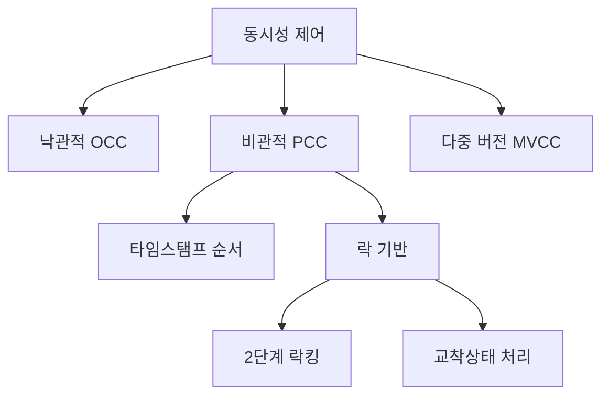

# Week10: Concurrency Control

# 1. 전체 개요

**동시성 제어의 목표**

- **효율성**: 여러 트랜잭션을 동시에 실행하여 처리량 증대
- **정확성**: ACID 속성을 보장하며 데이터 일관성 유지
- **확장성**: 시스템 규모 증가에 따른 성능 확장

**주요 접근 방식들**

| 기법 | 동시성 | 구현 복잡도 | 저장 오버헤드 | 적용 상황 |
| --- | --- | --- | --- | --- |
| **OCC** | 높음 | 중간 | 낮음 | 읽기 중심 |
| **MVCC** | 높음 | 높음 | 높음 | 혼합 워크로드 |
| **2PL** | 낮음 | 낮음 | 낮음 | 쓰기 중심 |
| **타임스탬프** | 중간 | 중간 | 중간 | 분산 시스템 |



# 2. 각 기법별 상세 정리

## 2.1 낙관적 동시성 제어 (OCC)

"충돌이 거의 없을 것"이라고 가정

**3단계 프로세스**

1. **Read Phase**: 개인 작업공간에서 자유롭게 실행
2. **Validation Phase**: 충돌 검사 후 통과/재시작 결정
3. **Write Phase**: 검증 통과 시에만 실제 커밋

**충돌 없는 조건**

- 시간적 분리: T1 완료 후 T2 시작
- 읽기-쓰기 분리: T1 쓰기 ∩ T2 읽기 = ∅
- 완전한 독립성: 서로 다른 데이터로 작업

**적용 상황**

- 읽기 중심 워크로드
- 짧은 트랜잭션
- 충돌률이 높지 않은 환경

## 2.2 다중 버전 동시성 제어 (MVCC)

**핵심 아이디어**: 각 데이터의 여러 버전을 동시 유지

**버전 관리 메커니즘**

```python
# 각 행의 메타데이터
Row: [ID=1, Data="김철수", xmin=100, xmax=NULL]
# xmin: 생성 트랜잭션 ID
# xmax: 삭제 트랜잭션 ID
```

**가시성 규칙**

- 자신이 만든 버전은 항상 보임
- 자신보다 늦게 시작된 트랜잭션 버전은 안 보임
- 커밋되지 않은 버전은 안 보임

### 2.2.1 장단점

**장점**

- 읽기-쓰기 독립성
- 일관된 스냅샷 제공

**단점**

- 저장 공간 오버헤드
- 가비지 컬렉션 필요

## 2.3 비관적 동시성 제어 (PCC)

**타임스탬프 순서 기법**

- 각 트랜잭션에 타임스탬프 부여
- 타임스탬프 순서 = 논리적 실행 순서
- 순서 위반 시 즉시 중단

### **2.3.1 토마스 쓰기 규칙**

```python
if transaction_ts < max_write_timestamp:
    # 일반적으로는 중단하지만
    # 토마스 규칙: 무시하고 계속
    return "WRITE_IGNORED"
```

- 어차피 덮어써질 데이터는 포기
    
    논리적 순서상 어차피 덮어써질 데이터이므로 ‘더 높은 타임스탬프 = 더 최신 데이터’이다.
    
- 불필요한 중단 감소

## 2.4 락 기반 동시성 제어

### **2.4.1 2단계 락킹 (2PL)**

- **Growing Phase**: 락만 획득, 해제 금지
- **Shrinking Phase**: 락만 해제, 획득 금지
- **핵심 규칙**: 한 번이라도 락을 해제하면 더 이상 획득 불가

### **2.4.1 2PL이 직렬화 가능성을 보장하는 이유**

1. 락 해제 = 다른 트랜잭션에게 끼어들 기회 제공
2. 새로운 락 획득 = 변경된 데이터 기반 작업
3. 결과: 비직렬화 가능한 혼재 상태
4. 2PL 규칙으로 이를 원천 차단

### Q2) 락 해제 후 획득의 금지

직렬화 가능성 보장을 위해 두 단계의 선후 관계를 보장한다.

- 락 해제 = 다른 트랜잭션 끼어들 기회
- 새 락 획득 = 변경된 데이터 기반 작업
- 결과: 비직렬화 가능한 상태 발생

### **2.4.2 교착상태 처리**

- **탐지**: Wait-for Graph의 사이클 검사
- **회피**: Wait-Die, Wound-Wait 기법
- **예방**: 보수적 2PL (모든 락 미리 획득)

# 3. 물리적 구조 보호: 락 vs 래치

## 3.1 락 (Lock)

**보호 대상**: 논리적 데이터 (계좌, 사용자 정보)
**지속 시간**: 트랜잭션 전체 기간
**목적**: 비즈니스 로직 일관성 보장

```python
# 락 사용 예시
transaction.begin()
lock_manager.acquire_lock("USER_123", "EXCLUSIVE")
# 비즈니스 로직 수행...
transaction.commit()  # 이때 락 해제

```

## 3.2 래치 (Latch)

**보호 대상**: 물리적 메모리 구조 (페이지, B-Tree 노드)
**지속 시간**: 연산 수행 중만 (마이크로초)
**목적**: 내부 자료구조 일관성 보장

```python
# 래치 사용 예시
page.acquire_write_latch()
split_btree_node()  # 물리적 구조 변경
page.release_write_latch()  # 즉시 해제

```

### **3.2.1 핵심 차이점**

- 락 = 집 열쇠 (오래 보관)
- 래치 = 화장실 문고리 (잠깐만 사용)

### Q1) 래치 != 트랜잭션 안의 락

래치와 트랜잭션은 완전히 다른 계층의 개념

- 래치는 트랜잭션과 무관하게 동작
- 시스템 내부 구현 세부사항
- 물리적 구조 vs 논리적 데이터

## 3.3 래치 크래빙 (Latch Crabbing)

**게 걸음 이동 방식**

1. 자식 노드 래치 획득
2. 안전 확인 (분할/병합 불필요)
3. 부모 노드 래치 해제
4. 다음 레벨로 이동

최소한의 래치만 보유하여 동시성을 향상시킬 수 있다.

# 4. B-Tree 변형들

## 4.1 B*-Tree

**핵심 개선**: 노드 공간 활용률 향상

**전략**

1. **재분배**: 분할 전 형제와 데이터 나눔
2. **2→3 분할**: 두 노드를 세 노드로 분할
3. **최소 점유율**: 66.7% (2/3) 보장

**효과**

- 더 높은 공간 효율성
- 더 적은 트리 높이
- 분할 횟수 감소

## 4.2 Blink-Tree

**핵심 개선**: 동시성 획기적 향상

**주요 구성요소**

1. **Right-Link**: 형제 노드 직접 연결
2. **High Key**: 노드 범위 명확화
3. **Half-Split**: 일시적 불일치 허용

### **4.2.1 동작 원리**

```python
# Half-Split 복구
if search_key > node.high_key:
    # "분할이 진행 중이구나!"
    node = node.right_sibling  # 형제로 이동

```

### **4.2.2 장점**

- 읽기와 쓰기 동시 진행 가능
- 교착상태 방지 (단방향 링크)
- 락 경합 최소화
